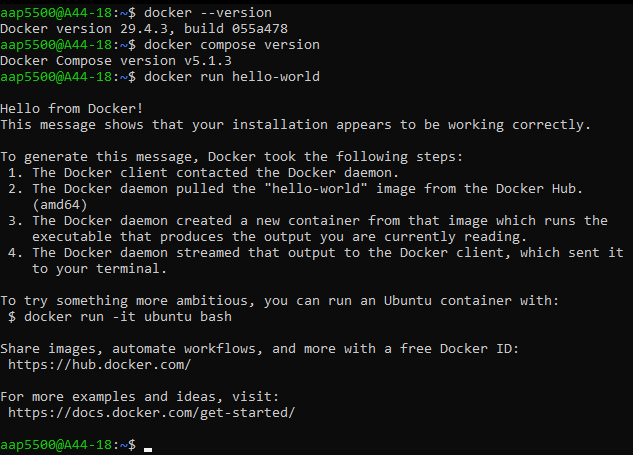
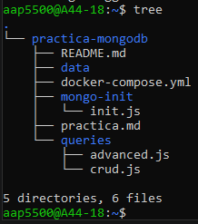
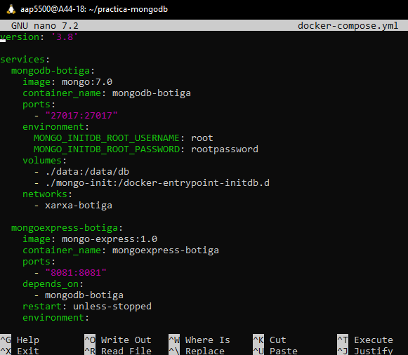
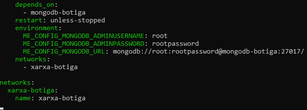

# Respostes a les preguntes teòriques - Pt1.5 MongoDB

## Bloc 1: Configuració Docker Compose

**1. Quina és la diferència entre docker run i docker compose up?**
`docker run` s'utilitza per iniciar un únic contenidor des del terminal, introduint manualment els paràmetres a cada execució. `docker compose up` llegeix el fitxer declaratiu `docker-compose.yml` per orquestrar i iniciar múltiples contenidors alhora de forma automatitzada.

**2. Per a què serveix la instrucció depends_on? Garanteix que el servei dependent estigui completament operatiu?**
Serveix per establir l'ordre d'arrencada entre contenidors. No garanteix que el servei estigui operatiu; només indica que el contenidor s'ha iniciat, però no comprova si el procés intern (com el motor de la base de dades) ja pot acceptar connexions.

**3. Explica quina és la diferència entre una xarxa bridge per defecte i una xarxa personalitzada.**
La xarxa `bridge` per defecte permet comunicació per IP, la qual pot canviar. Una xarxa personalitzada proporciona resolució DNS automàtica, permetent que els contenidors es comuniquin pel seu nom (ex: `mongodb-botiga`), a més d'oferir millor aïllament.

